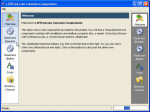
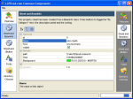
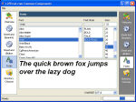
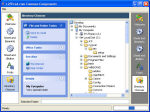
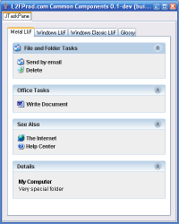
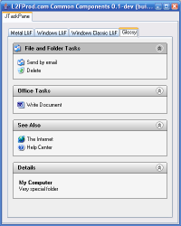

# L2FProd.com Common Components

:warning: This project is no longer maintained. Not guaranteed to compile with modern JDK.

Swing has lot of components built-in but still some are missing. This
project provides the developer community with these missing
components, components inspired (copied?!) from modern user
interfaces.

<table cellspacing="5" border="0">
  <tr>
    <td align="center">
      <a href="xdocs/ButtonBar.jpg">
        
      </a>
    </td>
    <td align="center">
      <a href="xdocs/PropertySheet.jpg">
        
      </a>
    </td>
  </tr>
  <tr>
    <td align="center">
      <a href="xdocs/FontChooser.jpg">
        
      </a>
    </td>
    <td align="center">
      <a href="xdocs/JTaskPane-DirectoryChooser.jpg">
        
      </a>
    </td>
  </tr>
  <tr>
    <td align="center">
      <a href="xdocs/taskpane-ocean.png">
        
      </a>
    </td>
    <td align="center">
      <a href="xdocs/taskpane-glossy.png">
        
      </a>
    </td>
  </tr>
</table>
      
## The Components

the JButtonBar - it is a bar made of buttons [sic], you have seen it
in Mozilla Firebird, IntelliJ.

the JOutlookBar - as seen in Outlook, it stacks components together
and allows only one of the stack to be visible at a given time. The
component extends the JTabbedPane, no surprise regarding its API.

the JTaskPane and JTaskPaneGroup - lot of recent applications bring
contextual item lists from which you can pick tasks related to the
current selection or context. The JTaskPane and JTaskPaneGroup deliver
this feature to java applications.

the JFontChooser and JDirectoryChooser - surprisingly Swing has no
font chooser and using the original JFileChooser to select a directory
is kind of not so user friendly...well, you know how it works.
JFontChooser and JDirectoryChooser address these two issues.

the PropertySheet - it puts together a list of properties and their
editors. Each property is given a name, a type, a description.It also
supports JavaBeans through BeanInfos and PropertyDescriptors.

the JTipOfTheDay - it brings the famous "Tip Of The Day" dialog to the
Swing toolkit.

## Build

   ```
   ant dist
   ```

## The Distribution

In the distribution, there are several jar files, one per component
plus one including all components. This allows developers to include
only the classes for the components they want to use.

To run the demo from the distribution, use:
   ```
   java -jar lib\l2fprod-common-all.jar
   ```

Each jar embeds its own demo too. For example to view the JTaskPane
demo, use:

   ```
   java -jar lib\l2fprod-common-tasks.jar
   ```
